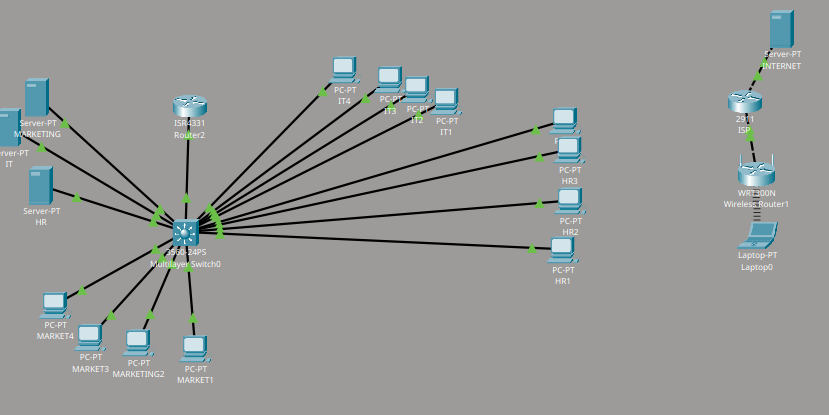

# Full Company Network Model

A comprehensive company network model built using **Cisco Packet Tracer**, featuring implemented security policies, isolated guest access, and role-based server permissions.

## Network Components
 **IT Department:** 4 Computers (Full access privileges)
 **Marketing Department:** 4 Computers (Restricted access)
 **HR Department:** 4 Computers (Restricted access)
 **Core & Routing Hardware:** 
  * 3560-24PS (Switch)
  * ISR4331 (Router)
* **Backend Part:** 3 Servers
* **Guest Network:** Isolated wireless network with internet access only
Note:The Guest Network Password is 12345678

## Security & Access Control Policies
 **Isolated Guest Network:** The guest Wi-Fi network is completely isolated from the internal corporate network for enhanced security.
 **Role-Based Access:** 
   **IT Department** has full administrative access to all backend servers.
   **Other Departments (HR & Marketing)** have restricted access, limited exclusively to their respective servers/resources.

## How to Test
1. Install **Cisco Packet Tracer** on your device.
2. Sign in with your NetAcad/Cisco account.
3. Download the `.pkt` file from this repository and open it to test the routing, connectivity, and security rules (ACLs/Permissions).

